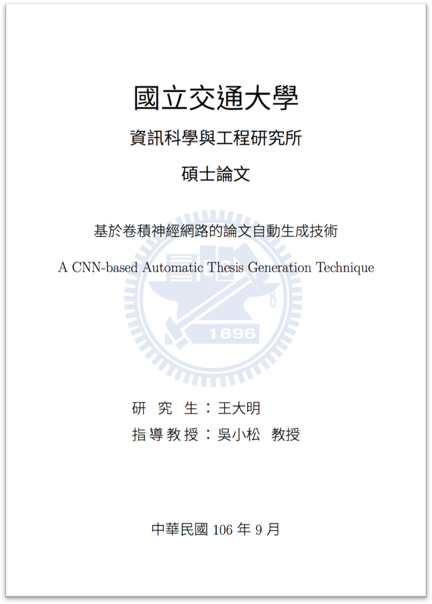

NCTU Thesis Template for LaTeX
==============================

**nctu-thesis-latex** is a LaTeX template forked from [chiehmin/nctu-thesis](https://github.com/chiehmin/nctu-thesis). Some improvements are added and the format is fune-tuned to meet the requirements of the thesis submitted to National Chiao Tung University.

# Sample

- Version for paper submission: [sample_paper.pdf](sample_paper.pdf)
- Version for electronic submission: [sample_electronic.pdf](sample_electronic.pdf)



# Configuration

1. Fill in the thesis information in `thesis.tex`.

```
\def\universityCh{國立交通大學}
\def\universityEn{National Chiao Tung University}
\def\collegeCh{資訊學院}
\def\collegeEn{College of Computer Science}
\def\instituteCh{資訊科學與工程研究所}
\def\instituteEn{Institute of Computer Science and Engineering}
\def\degree{Master in Computer Science}
\def\titleCh{基於卷積神經網路的論文自動生成技術}
\def\titleEn{A CNN-based Automatic Thesis Generation Technique}
\def\studentCh{王大明}
\def\studentEn{Ta-Ming Wang}
\def\advisorCh{吳小松}
\def\advisorEn{Xiao-Sung Wu}
\def\defenseYear{2017}\def\defenseYearROC{106}
\def\defenseMonth{9}\def\defenseMonthEn{September}
```

2. In `thesis.tex`, there is a flag called `paper` which can help you switch the format between paper submission and electronic submission.

```
\settoggle{paper}{false} % set to true for paper submission
```

- Paper submission
    - Margin: 2.5cm-2.5cm-2.5cm-2.5cm
    - Without watermark
    - With required documents (i.e., 論文審訂書, 圖書館電子授權書)
- Electronic submission
    - Margin: 2.5cm-2.5cm-3cm-2cm
    - With watermark

3. After oral defense, update the paths of required forms and documents in `thesis.tex`.

```
\includepdf{pdf/certification.pdf}
\includepdf{pdf/authorization.pdf}
```

# Environment

I have only tested this template on [Overleaf](https://www.overleaf.com) with XeLaTeX engine. Local LaTeX environment may also work.
